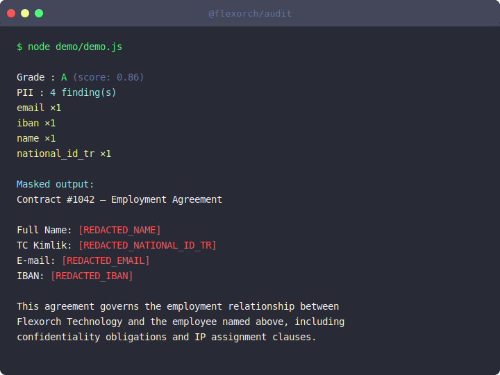

# @flexorch/audit

[](https://www.npmjs.com/package/@flexorch/audit)
[](https://www.npmjs.com/package/@flexorch/audit)
[](LICENSE)

Zero-dependency PII detection, quality grading, and noise audit for LLM datasets — in a single function call.

## Why

Before feeding documents into an LLM pipeline you need to answer three questions:

1. **Does this text contain personal data?** Sending PII to a language model is a compliance risk.
2. **Is the text quality high enough?** Short, noisy, or duplicate records hurt fine-tuning and RAG retrieval.
3. **How bad is the noise?** Garbled encodings and symbol clutter degrade model output silently.

Most tools that answer these questions require heavy NLP frameworks, model weights, or cloud APIs. `@flexorch/audit` answers all three with one call — using only regex and Node.js built-ins. No model weights, no network calls, no external packages.

## Features

- **Quality grade** — A/B/C/D composite score: is this text LLM-ready at a glance?
- **Noise ratio** — line-level symbol clutter detection (`noise_ratio`); values above 0.20 indicate likely extraction artifacts
- **PII detection** — 30+ types across 8 countries (TR/DE/FR/IT/NL/ES/UK/US) + universal types; all regex-based with checksum validation
- **Batch audit** — `auditBatch()` aggregates duplicate ratio and PII counts across an entire dataset in one call
- **Masking** — four strategies: redact, replace (synthetic), token, hash
- **Zero runtime dependencies** — pure Node.js built-ins, Node 18+
- **TypeScript-first** — full type definitions, no `@types/` package needed

## Install

```bash
npm install @flexorch/audit
```

## Quick start

```ts
import { audit, mask } from "@flexorch/audit"
import { readFileSync } from "fs"

const text = readFileSync("contract.txt", "utf8")  // extract from PDF/DOCX first

const result = audit(text)                          // "und" by default — all detectors active
// const result = audit(text, { locale: "tr" })    // restrict to TR-only detectors

result.quality_grade      // "B"
result.quality_score      // 0.73  (0.0–1.0 composite)
result.noise_ratio        // 0.04  (fraction of blank/garbage lines; >0.20 = low quality)
result.detected_language  // "und" (locale you passed in; caller controls language)
result.pii_summary        // [{ type: "email", count: 2 }, { type: "national_id_tr", count: 1 }]

result.pii      // [{ type: "email", value: "ali@example.com", start: 8, end: 23 }]
result.quality  // { completeness: 1.0, avg_length: 342, duplicate_ratio: null }
result.noise    // { garbage_ratio: 0.0, encoding_ok: true }

const clean = mask(text, result.pii, { strategy: "redact" })
// "Contact: [REDACTED_EMAIL]"
```



## Batch audit

```ts
import { auditBatch } from "@flexorch/audit"

const texts = dataset.map((r) => r.text)
const batch = auditBatch(texts)              // locale: "und" by default

batch.duplicate_ratio    // 0.12 — fraction of exact-duplicate records
batch.avg_quality_score  // 0.78
batch.pii_summary        // [{ type: "email", count: 47 }, ...]
batch.results            // AuditResult[], one per text
```

## Country coverage

| `locale` | Detectors activated |
|----------|---------------------|
| `"und"` **(default)** | All locales combined — use when document language is unknown |
| `"all"` | Alias for `"und"` |
| `"tr"` | TCKN · VKN · phone_tr · name · IBAN_TR · company_name_tr · MERSIS · postal_code_tr · province_tr |
| `"de"` | Steueridentifikationsnummer · Sozialversicherungsnummer |
| `"fr"` | SIREN · SIRET · INSEE/NIR |
| `"it"` | Codice Fiscale · Partita IVA |
| `"nl"` | BSN · KvK |
| `"es"` | DNI/NIE · CIF |
| `"uk"` | NI number · UTR |
| `"us"` | SSN · EIN · ITIN |
| `"eu"` | E.164 phone · IBAN (EU+GB+CH+NO) · company name |

Universal detectors (always active regardless of locale): `email` · `iban` · `credit_card` · `ip` · `ip_v6`

> **Language detection:** `@flexorch/audit` is zero-dependency — no language detection library is included.
> Pass the correct `locale` yourself, or use `"und"` (default) to activate all detectors.

## PII types

### Universal

| Type | Description |
|------|-------------|
| `email` | RFC-5321 email address |
| `iban` | ISO 13616 IBAN — mod-97 validated; suppressed when `iban_tr` or `iban_intl` fires on same span |
| `credit_card` | 16-digit groups, Luhn-validated |
| `ip` | IPv4 address |
| `ip_v6` | IPv6 — full, compressed `::`, loopback forms |

### Turkey (`locale="tr"`)

| Type | Description |
|------|-------------|
| `national_id_tr` | TCKN — 11-digit, modular arithmetic checksum |
| `tax_id_tr` | VKN — 10-digit, Luhn-variant checksum |
| `phone_tr` | Turkish mobile: `+90`/`0` prefix + 10 digits |
| `name` | Label-prefixed name: `Adı:`, `Full Name:`, `Customer Name:`, etc. |
| `iban_tr` | Turkish IBAN (`TR` + 24 chars), mod-97 validated |
| `company_name_tr` | Company with TR legal suffix: A.Ş. · Ltd.Şti. · Koll.Şti. · Koop. · T.A.Ş. |
| `mersis_no` | MERSIS — 16-digit company registry number |
| `postal_code_tr` | Turkish postal code (province plate 01–81) |
| `province_tr` | All 81 Turkish provinces |

### Germany (`locale="de"`)

| Type | Description |
|------|-------------|
| `tax_id_de` | Steueridentifikationsnummer — 11 digits, ISO 7064 MOD 11,2 checksum |
| `social_id_de` | Sozialversicherungsnummer — area + DOB + letter + serial |

### France (`locale="fr"`)

| Type | Description |
|------|-------------|
| `siret_fr` | SIRET — 14 digits, label-prefix gated |
| `company_id_fr` | SIREN — 9 digits, label-prefix gated |
| `social_id_fr` | INSEE/NIR — 15 digits, starts with `1` or `2` |

### Italy (`locale="it"`)

| Type | Description |
|------|-------------|
| `national_id_it` | Codice Fiscale — 16 chars alphanumeric, uppercase normalized |
| `tax_id_it` | Partita IVA — 11 digits, Agenzia delle Entrate checksum |

### Netherlands (`locale="nl"`)

| Type | Description |
|------|-------------|
| `national_id_nl` | BSN — 9 digits, 11-check (weighted sum mod 11) |
| `company_id_nl` | KvK — 8 digits, label-prefix gated |

### Spain (`locale="es"`)

| Type | Description |
|------|-------------|
| `national_id_es` | DNI (8 digits + letter, mod-23) and NIE (X/Y/Z prefix, same check) |
| `tax_id_es` | CIF — letter prefix + 7 digits + control character |

### United Kingdom (`locale="uk"`)

| Type | Description |
|------|-------------|
| `social_id_uk` | NI number — 2 letters + 6 digits + A/B/C/D; HMRC forbidden prefixes excluded |
| `tax_id_uk` | UTR — 10 digits, label-prefix gated |

### United States (`locale="us"`)

| Type | Description |
|------|-------------|
| `ssn` | SSN — `###-##-####`, invalid prefixes (000/666/9xx) excluded |
| `tax_id_us` | EIN — `XX-XXXXXXX`, IRS invalid area prefixes excluded |
| `national_id_us` | ITIN — `9XX-7X/8X/9X-XXXX` middle group validated |

### EU / International (`locale="eu"`)

| Type | Description |
|------|-------------|
| `phone_intl` | E.164 international phone — 7–15 digits, TR (+90) excluded |
| `iban_intl` | IBAN for EU+GB+CH+NO — ISO 13616 country+length table + mod-97 |
| `company_name_intl` | Company with international suffix: GmbH · LLC · S.r.l. · B.V. · SAS · Inc. · Ltd. etc. |

## Noise detection

`noise_ratio` measures the fraction of lines that are blank or contain symbol clutter:

```ts
const result = audit("clean line\n@@@garbage\n\nclean")
result.noise_ratio   // 0.5  (2 noisy lines out of 4)
```

A line is "noisy" when it is blank (after trim) or contains 3+ consecutive characters from `@ # ! ~ * =`.

| `noise_ratio` | Signal |
|---------------|--------|
| `< 0.05` | Clean — likely well-extracted text |
| `0.05–0.20` | Acceptable — minor formatting artifacts |
| `> 0.20` | Low quality — likely OCR noise or extraction failure |

## Masking strategies

```ts
const clean = mask(text, result.pii)                              // redact (default)
const clean = mask(text, result.pii, { strategy: "token" })
const clean = mask(text, result.pii, { strategy: "hash" })
const clean = mask(text, result.pii, { strategy: "replace" })
```

| Strategy | Example output |
|----------|----------------|
| `redact` (default) | `[REDACTED_EMAIL]` |
| `replace` | `user@example.com` (static synthetic) |
| `token` | `<PII_EMAIL_1>` (unique per type per call) |
| `hash` | `[3d4f9a1b2c8e7f0a]` (SHA-256 first 16 hex chars) |

## TypeScript

Full type definitions — no `@types/` package needed:

```ts
import {
  audit, auditBatch, mask,
  type AuditResult, type BatchAuditResult,
  type PiiFinding, type AuditOptions,
} from "@flexorch/audit"
```

`AuditResult` includes:

```ts
interface AuditResult {
  quality_grade: "A" | "B" | "C" | "D"
  quality_score: number
  noise_ratio: number
  detected_language: string
  pii_summary: { type: string; count: number }[]
  pii: { type: string; value: string; start: number; end: number }[]
  quality: { completeness: number; avg_length: number; duplicate_ratio: number | null }
  noise: { garbage_ratio: number; encoding_ok: boolean }
}
```

## Quality grade

`quality_grade` (A–D) and `quality_score` (0.0–1.0) are composite signals:

| Grade | Score | Signal |
|-------|-------|--------|
| A | ≥ 0.85 | Ready for LLM training or RAG |
| B | ≥ 0.65 | Usable with minor cleanup |
| C | ≥ 0.40 | Review before use |
| D | < 0.40 | Not suitable — empty, too short, or high noise |

Score formula: `completeness × (0.4 × noiseScore + 0.4 × lengthScore + 0.2)`  
`lengthScore = Math.min(charCount / 500, 1.0)` · `noiseScore = Math.max(0, 1 − garbageRatio × 10)`

## Limitations

- **No automatic language detection** — `@flexorch/audit` has zero dependencies. Pass `locale` explicitly, or use the default `"und"` to activate all detectors.
- **Free-standing name detection** (without a label prefix) requires NLP/NER — not included.
- `replace` masking uses static synthetic values; locale-aware realistic synthesis is not implemented.
- The library audits plain text. PDF/DOCX parsing, e-invoice extraction, and pipeline orchestration are out of scope.

## Also available for Python

```bash
pip install flexorch-audit
```

## Contributing

See [CONTRIBUTING.md](CONTRIBUTING.md).

## License

MIT
